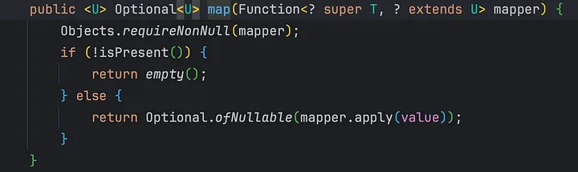

## Performing Operations in Optional
We have some methods which help us in performing some operations.

### map() in optionals
Yes, you read it right, just like stream, we also have `map()` in optional class in java. It is similar to stream differing in one aspect that it takes a function (mapper or transformer) and returns an optional if the value is present or returns empty optional if value is absent. If the mapper function passed is null., it throws NullPointerException.

Similarly, we have filter method in optional. It applies a predicate if optional is present and true if the predicates evaluates or empty if predicate does not evaluate. If the optional is not present, it returns empty. If predicate provided is null, it throws NullPointerException similar to `map()`.