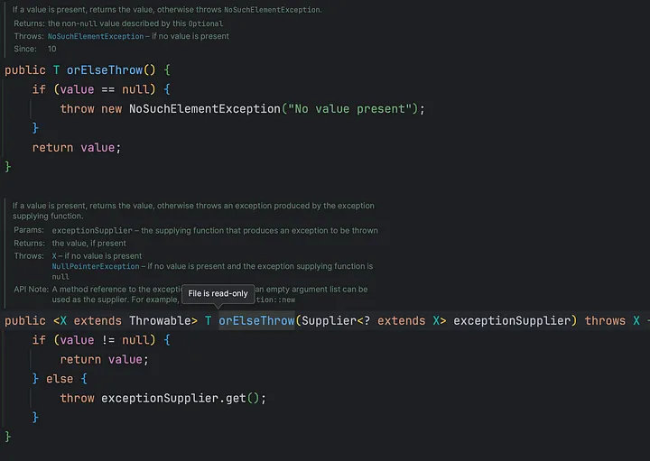

## Throwing Exceptions If Optional is Absent
There might be some cases where we just want to throw the exceptions when the wrapped value is not present, let's see how can we do that. Optional provides a method `orElseThrow()`, using which we can throw the exceptions. It comes with two variations, the plain `orElseThrow()` and `orElseThrow(exceptionSupplier)`. Let’s look at official docs.

### orElseThrow()

As you can see above, the first one throws the `NoSuchElementException` with a message `“No value present”` and the second one takes a supplier to get the exception and then throws it.
